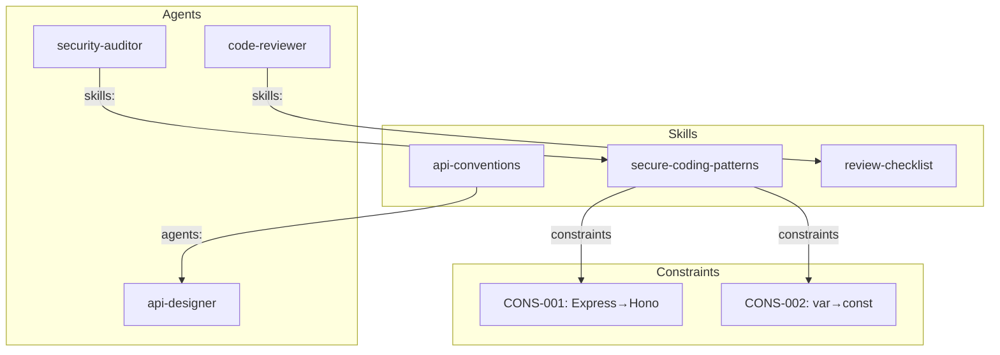
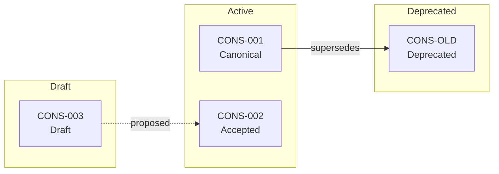
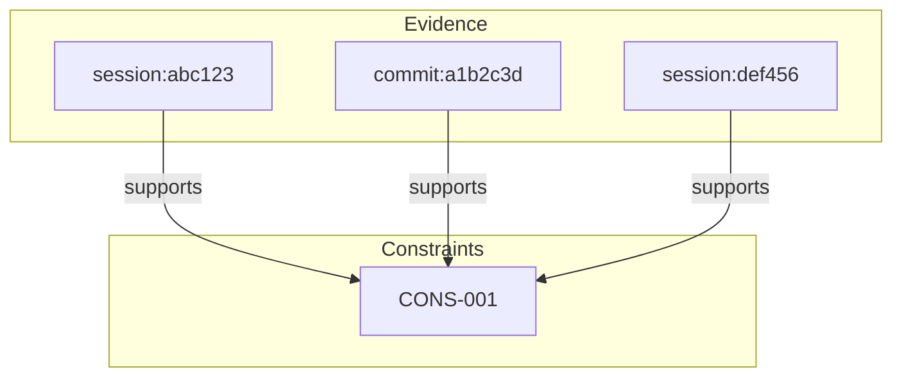
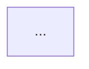

# Proposal-Commit Workflow

制約とスキルの提案から確定までのワークフロー。

---

## ワークフロー概要

> "Observation → Drafting → Promotion → Refining" (Gemini)

```
┌─────────┐     ┌─────────┐     ┌─────────┐     ┌─────────┐
│ Observe │────►│  Draft  │────►│ Promote │────►│ Refine  │
└─────────┘     └─────────┘     └─────────┘     └─────────┘
     │               │               │               │
     ▼               ▼               ▼               ▼
  自動検出        自動生成        手動承認        継続改善
  (Silent)       (Hidden)       (Explicit)      (Iterative)
```

---

## フェーズ詳細

### 1. Observe（観察）

**トリガー**: `/gen-all`, `/gen-agents`, `/gen-skills`

**処理**:
- 会話履歴、Git、コードベースをスキャン
- パターン候補を抽出
- 既存との重複・競合をチェック

**ユーザー制御**: Silent（バックグラウンド）

### 2. Draft（下書き）

**出力先**: `.claude/skills/[name]/SKILL.md` (maturity: draft)

**特性**:
- 強制力: Warning のみ
- TTL: 30日
- CI: 通知のみ

**ユーザー制御**: Hidden（ファイルは生成されるが、昇格まで強制なし）

### 3. Promote（昇格）

**トリガー**: `/skill-promote`

**チェックリスト**:
```
□ Eval Pass Rate >= 80%
□ Staleness Score >= 0.5
□ No Regression
□ Rationale 記録
```

**ユーザー制御**: Explicit（手動承認必須）

### 4. Refine（改善）

**操作**:
- Update: 新パターン追加
- Merge: 類似制約の統合
- Split: 複雑な制約の分離
- Deprecate: 廃止

**ユーザー制御**: Iterative（継続的改善）

---

## Rationale Extractor

> "Why capture pipeline - actively harvest rationale with micro-prompts" (ChatGPT)

### 概念

パターンの「なぜ」を能動的に収集。推論ではなく、ユーザーから直接取得。

### 収集タイミング

| イベント | 収集方法 |
|---------|---------|
| 修正時 | 「なぜこの変更？」のマイクロプロンプト |
| PR マージ時 | PR 説明から抽出 |
| 昇格時 | 必須入力 |
| 再確認時 | オプション入力 |

### マイクロプロンプト

修正が検出された時:

```
変更を検出しました: Express → Hono

理由を簡単に教えてください（1行）:
[ ] Performance（パフォーマンス）
[ ] Security（セキュリティ）
[ ] Maintainability（保守性）
[ ] Team Standard（チーム標準）
[ ] Other: ___________

スキップ: Enter
```

### Rationale の保存

```yaml
constraints:
  - id: CONS-001
    pattern: "Express.js router"
    instead: "Hono framework"
    rationale:
      text: "Better performance and smaller bundle size"
      category: performance
      collected_at: 2025-01-03
      source: user_prompt  # user_prompt | pr_description | manual
```

### Rationale 不明時

```yaml
rationale:
  text: "UNKNOWN"
  status: pending
  reminder_at: 2025-01-10  # 7日後にリマインド
```

昇格時に再度プロンプト。

---

## Mermaid Export

依存関係を視覚化。

### 生成コマンド

```bash
/skill-graph                 # ターミナル出力
/skill-graph --mermaid       # Mermaid 形式
/skill-graph --pr            # PR 用フォーマット
```

### Agent-Skill グラフ



### Constraint 依存グラフ



### Evidence Flow



### PR 出力形式

```markdown
## Skill Dependency Graph



### Changes in This PR

- Added: CONS-NEW (Draft)
- Updated: CONS-001 (+1 evidence)
- Deprecated: CONS-OLD
```

---

## CLI コマンド一覧

### 観察・生成

| コマンド | 説明 |
|---------|------|
| `/gen-all` | Agent + Skill 生成 |
| `/gen-agents` | Agent のみ生成 |
| `/gen-skills` | Skill のみ生成 |

### 評価

| コマンド | 説明 |
|---------|------|
| `/skill-eval` | Golden Tasks 実行 |
| `/skill-eval --baseline` | ベースライン比較 |
| `/skill-eval --regression CONS-XXX` | 回帰テスト |

### 昇格・管理

| コマンド | 説明 |
|---------|------|
| `/skill-promote` | 昇格候補表示 |
| `/skill-promote CONS-XXX` | 特定制約を昇格 |
| `/skill-status` | 全制約の状態表示 |
| `/skill-overrides` | Override 履歴 |

### 可視化

| コマンド | 説明 |
|---------|------|
| `/skill-graph` | 依存グラフ表示 |
| `/skill-graph --mermaid` | Mermaid 出力 |

### 抽出

| コマンド | 説明 |
|---------|------|
| `/skill-extract-golden` | Golden Task 抽出 |
| `/skill-create-golden` | Golden Task 手動作成 |

---

## Promotion Checklist 自動生成

`/skill-promote` 時に自動表示:

```markdown
## Promotion Checklist: CONS-001

### Evaluation
- [x] Eval Pass Rate: 92% (>= 80%) ✓
- [x] Golden Tasks: 5 tested (>= 3) ✓
- [x] No Regression ✓

### Lifecycle
- [x] Staleness: 0.85 (>= 0.5) ✓
- [x] Override Frequency: 0/week (< 2) ✓
- [ ] Rationale: PENDING ⚠️

### Conflicts
- [x] No duplicates ✓
- [x] No contradictions ✓

---

**Status**: Ready (1 action required)
**Action**: Provide rationale to proceed

Rationale: ___________
```

---

## 統合例

### GitHub PR ワークフロー

1. `/gen-all` で新パターン検出（Draft 生成）
2. PR 作成時に `/skill-graph --pr` で依存関係添付
3. CI で `/skill-eval --ci` 実行
4. マージ後、`/skill-promote --all-eligible` で昇格
5. 昇格時に Rationale プロンプト

### 日次運用

```bash
# 朝: 状態確認
/skill-status

# 開発中: パターン観察
/gen-all

# コミット前: レビュー
/skill-for-review --staged

# 週次: 昇格判断
/skill-promote
```
